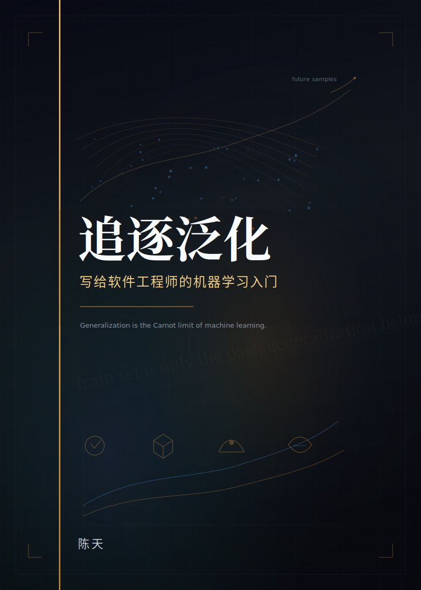

# Open Books

<p align="center">
  <strong>我个人使用自己构建的 bukit 系统，用 AI 写作、Typst 排版、github 发布的中文开放书库。</strong>
</p>

<p align="center">
  这里收纳的是可以独立编译的完整书稿：每一本书都有自己的入口文件、排版模板、插图资产与封面设计。
  仓库的目标不是保存零散文章，而是把长期写作沉淀成可以构建、可以版本化、可以发布的书。
</p>

<p align="center">
  <a href="#书目">书目</a> ·
  <a href="#构建">构建</a> ·
  <a href="#目录结构">目录结构</a> ·
  <a href="#发布">发布</a>
</p>

<br>

<p align="center">
  <a href="chasing-carnot">
    
  </a>
  &nbsp;&nbsp;&nbsp;
  <a href="ml-fundamentals">
    
  </a>
</p>

## 书目

| 书名 | 主题 | 最新 PDF |
| --- | --- | --- |
| **《追赶卡诺》**<br>给青少年的物理与工程文明史 | 从伽利略的斜面、托里拆利的真空、瓦特的蒸汽机一路讲到内燃机、电网、核能、光伏与火箭，把工业文明背后的能量转换逻辑重新串成一条可计算的线。 | [下载 PDF](https://github.com/tyrchen/open-books/releases/download/chasing-carnot-v0.1.0/chasing-carnot.pdf) |
| **《追逐泛化》**<br>写给软件工程师的机器学习入门 | 以软件工程师的视角进入机器学习：从样本、特征、损失、优化和评估出发，走向线性模型、树模型、神经网络、RAG 与生产反馈闭环。 | [下载 PDF](https://github.com/tyrchen/open-books/releases/download/ml-fundamentals-v0.4.0/ml-fundamentals-v0.4.0.pdf) |

## 为什么是这个仓库

现代写作越来越像软件工程：内容需要可复现的构建流程，图片和模板需要与正文一起版本化，发布也应该尽量自动化。这个仓库采用一书一目录的方式组织书稿，让每本书都能在脱离外部私有系统的情况下独立编译。

每本书至少包含：

- `book.typ`：书稿入口。
- `template.typ`：本书使用的 Typst 排版模板。
- `wrap-it.typ`：辅助排版逻辑。
- `assets/`：封面、章节图、示意图与其他本地资源。

## 构建

先安装 [Typst](https://typst.app/)，然后在仓库根目录执行：

```sh
make pdf BOOK=chasing-carnot
```

生成的 PDF 会写入：

```text
dist/chasing-carnot.pdf
```

构建另一本书：

```sh
make pdf BOOK=ml-fundamentals
```

列出当前可构建的书：

```sh
make list
```

清理构建产物：

```sh
make clean
```

## 目录结构

```text
.
├── Makefile
├── README.md
├── chasing-carnot/
│   ├── book.typ
│   ├── template.typ
│   ├── wrap-it.typ
│   └── assets/
└── ml-fundamentals/
    ├── book.typ
    ├── template.typ
    ├── wrap-it.typ
    └── assets/
```

## 发布

发布通过 Git tag 触发。Tag 格式为：

```text
<book-name>-v*
```

例如：

```sh
git tag chasing-carnot-v0.1.0
git push origin chasing-carnot-v0.1.0
```

GitHub Actions 会只构建对应的书，并把 `<book-name>-v<version>.pdf` 发布到该 tag 的 GitHub Release。

## 构建方法

这个仓库里的书都追求同一件事：把复杂主题写得严谨、漂亮、可读，并且可被重新构建。在我的私人仓库里，bukit 负责处理 DSL，生成图片，把书籍编译成 typst 格式，最终生成 pdf；Codex 负责构建 plan / 每一章的内容的撰写 / 润色；我负责审稿，校对。目前一本书 400-500 页的书需要 agent 工作至少 25 小时，花费 40-50% 的 codex pro 周额度。同时还需要花费我个人大概 5-10 小时粗略审校和优化 skills。

目前 bukit 工具还是闭源，还有大量的功能有待开发，大量的优化工作需要处理。它还不适合作为一个工具对外发布。所以我采用了用 bukit 生成所有 assets / typst 文档的方式开源这两本书。

